# Specification Phase Exercise

A little exercise to get started with the specification phase of the software development lifecycle. In this exercise, your team specifies a set of improvements and new features for [The Slide Machine](https://theslidemachine.com) — see the [instructions](instructions.md) for detail, and the [background](background.md) for an introduction to the software product you are tasked with extending.

## Team members

See instructions. Delete this line and replace with a list of the names of your team members, including links to each one's GitHub profile.

## Review of the Current Application

See instructions. Delete this line and replace with your team's findings from using the live app at https://theslidemachine.com — at least 10 specific observations, each labeled as a strength, a weakness, or a gap, and drawn from more than one team member's use of the app.

## Prior Art & Originality

See instructions. Delete this line and replace with a short statement of what your team checked (the project's Future Work and Open Questions, its roadmap, and its open issues and pull requests) and which parts of your proposal are original — new work not already specified, scheduled, or proposed by someone else.

## Stakeholders

See instructions. Delete this line and replace with the name(s) of the stakeholder(s) you interviewed and lists showing their goals/needs, and problems/frustrations. Note which type of user each stakeholder represents. You may use pseudonyms or partial names to maintain their privacy, but you must privately share their full names and contact information as part of your submission of this exercise

## Product Vision Statement

See instructions. Delete this line and place your Product Vision Statement here — one sentence describing the improvements and new features your team is proposing for The Slide Machine.

## User Requirements

See instructions. Delete this line and place a list of your User Stories here, grouped by type of user. These should describe functionality that is new or changed, not functionality the app already has.

## Activity Diagrams

The four activity diagrams describe interactive tutorials for existing Slide Machine features: recording and quiz creation for instructors, and translation and narration for students. Role selection organizes tutorial content without changing account permissions.

**Notation:** solid routes follow the reviewed prototype; dashed routes show proposed entry or recovery behavior. **Back to Tutorials** returns to Instructor / Student selection, using the team's agreed completion-button wording.

### Recording tutorial

<!-- Requirements lead: insert the matching final User Story text and reference here. -->

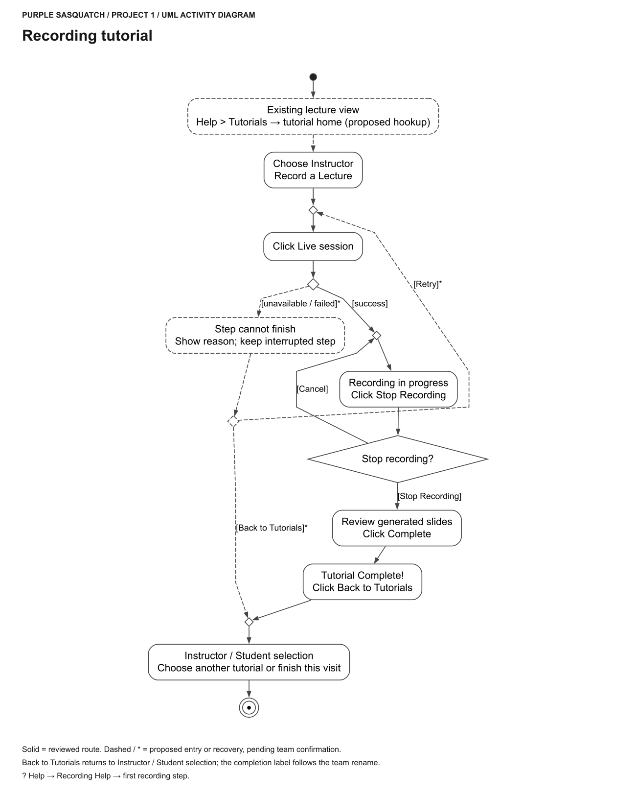

Start recording, stop, review the slides, and complete the tutorial. Canceling the stop confirmation returns to recording.

### Quiz tutorial

<!-- Requirements lead: insert the matching final User Story text and reference here. -->

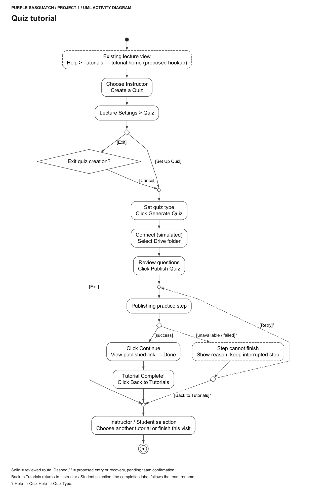

Set up a quiz, follow the simulated connection steps, review questions, and publish. In the exit-confirmation dialog, **Exit** returns to the tutorial home and **Cancel** returns to Quiz Type, matching the reviewed prototype.

### Translation tutorial

<!-- Requirements lead: insert the matching final User Story text and reference here. -->

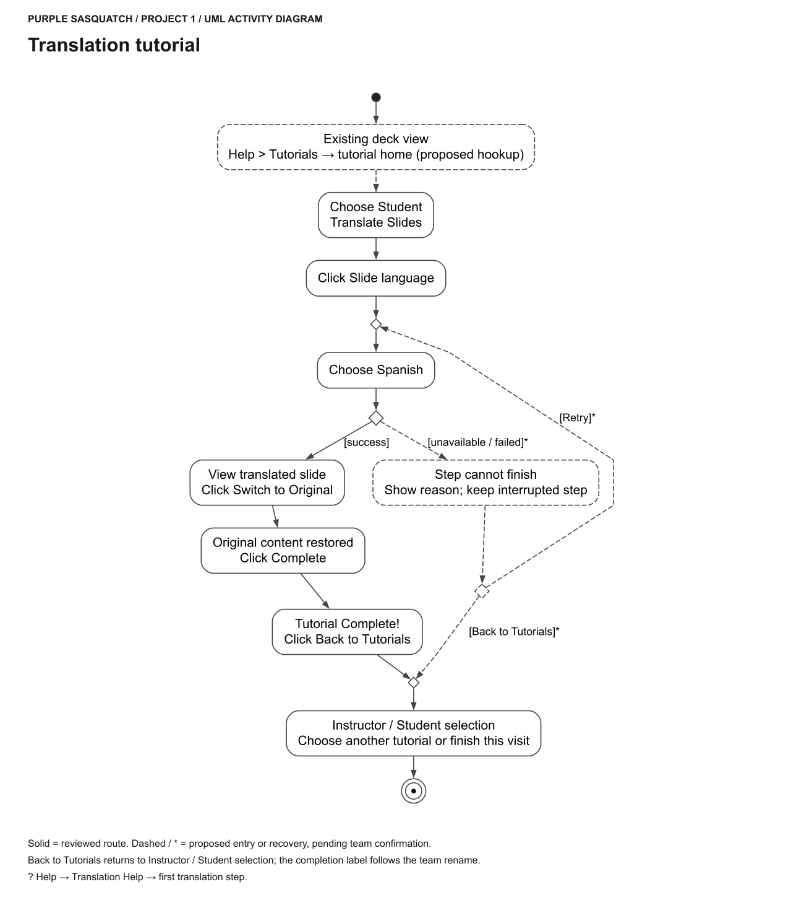

Select Spanish, view the translated slide, and switch back to Original English. The proposed failure path keeps the original content and offers retry or return to the tutorial home.

### Narration tutorial

<!-- Requirements lead: insert the matching final User Story text and reference here. -->

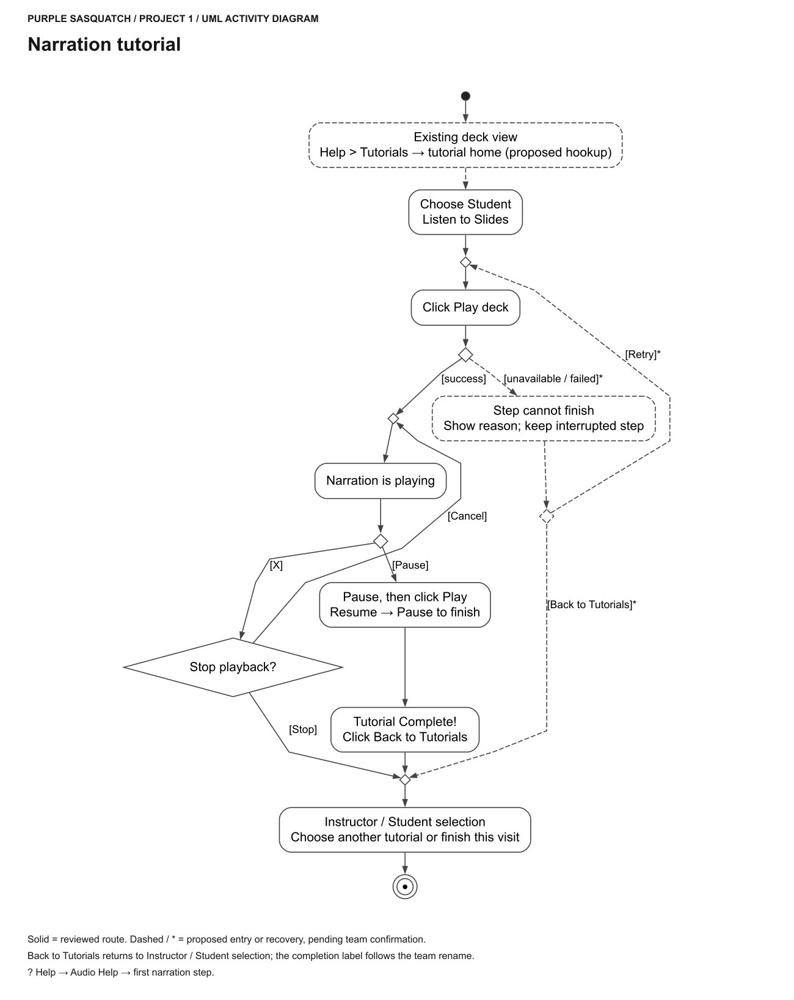

Play, pause, resume, and finish the narration tutorial. The stop confirmation lets the user continue playback or return to the tutorial home without completing the tutorial.

## Wireframes

The seven grayscale sheets show tutorial pages and dialogs grouped by task. They are simplified redraws based on the team's Figma, with shared layouts shown once. Dashed outlines identify proposed additions.

### Common pages

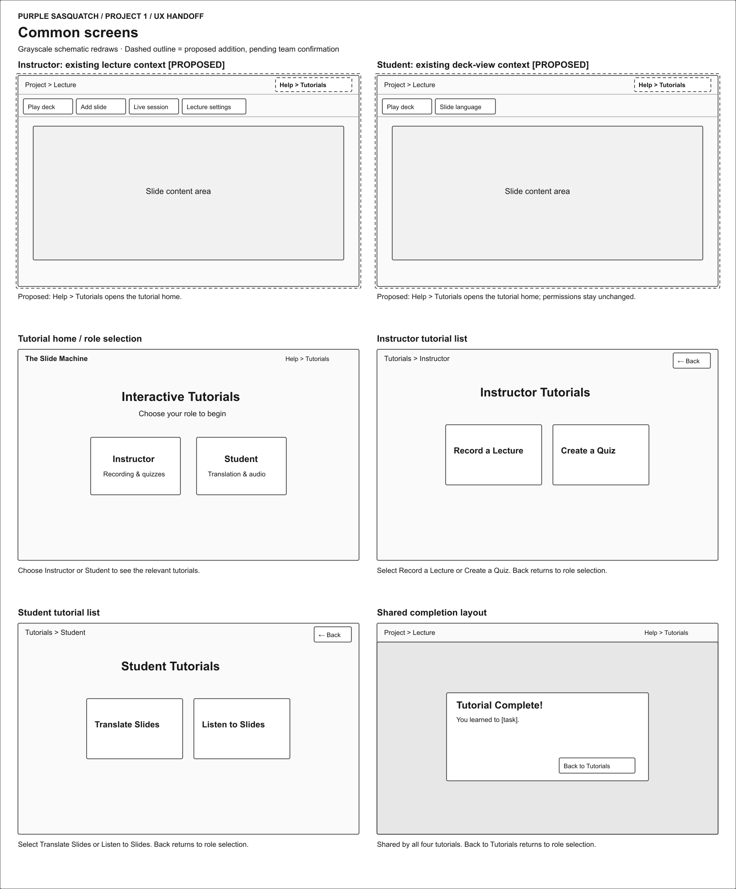

The proposed application entry leads to role selection and the relevant tutorial list. All four completion pages use **Back to Tutorials** to return to role selection.

### Recording tutorial

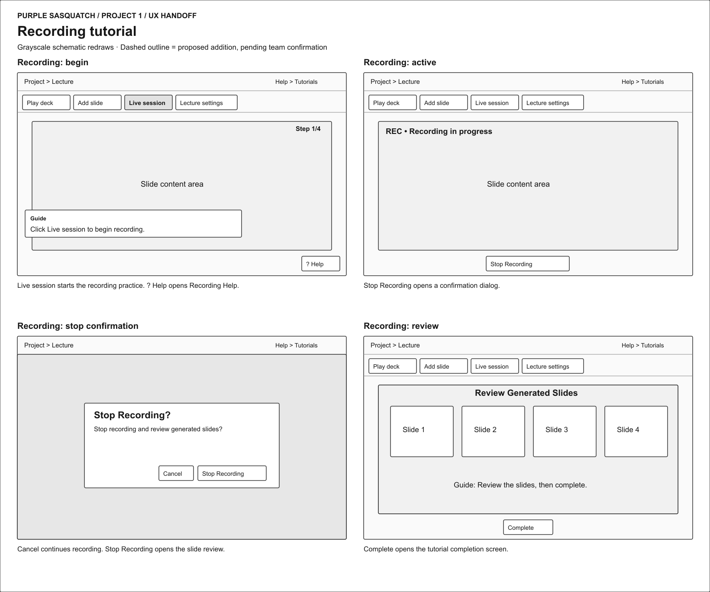

Start recording, view recording status, confirm stopping, and review generated slides.

### Quiz setup

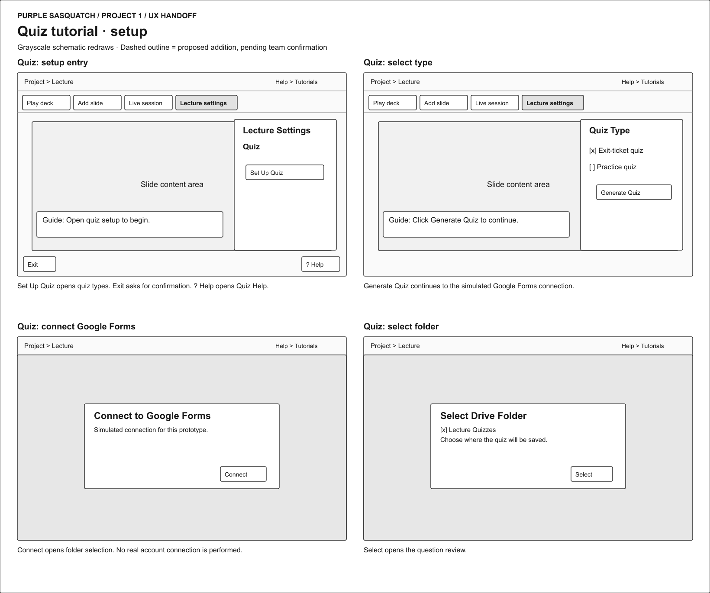

Open quiz settings, choose a quiz type, connect to Google Forms, and select a folder. Connection is simulated; no real authorization is performed.

### Quiz publishing and exit

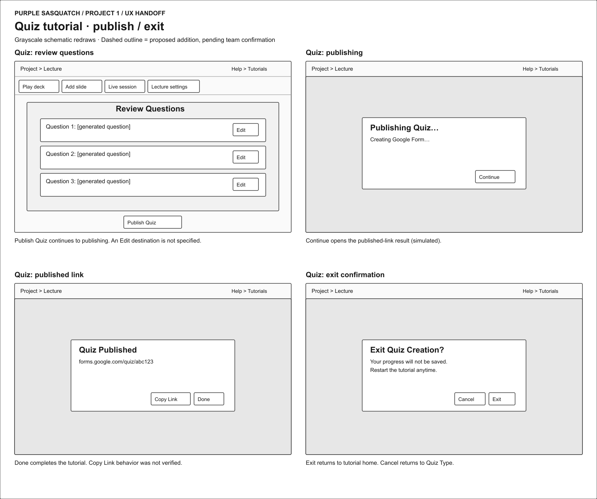

Review questions, publish, view the result, or confirm exit. Questions and the link are placeholders; Edit and Copy Link behavior were not verified.

### Translation tutorial

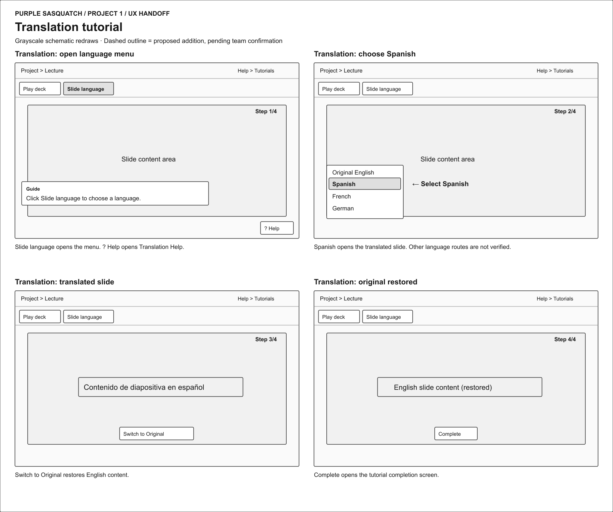

Open the language menu, select Spanish, view the translation, and restore Original English.

### Narration tutorial

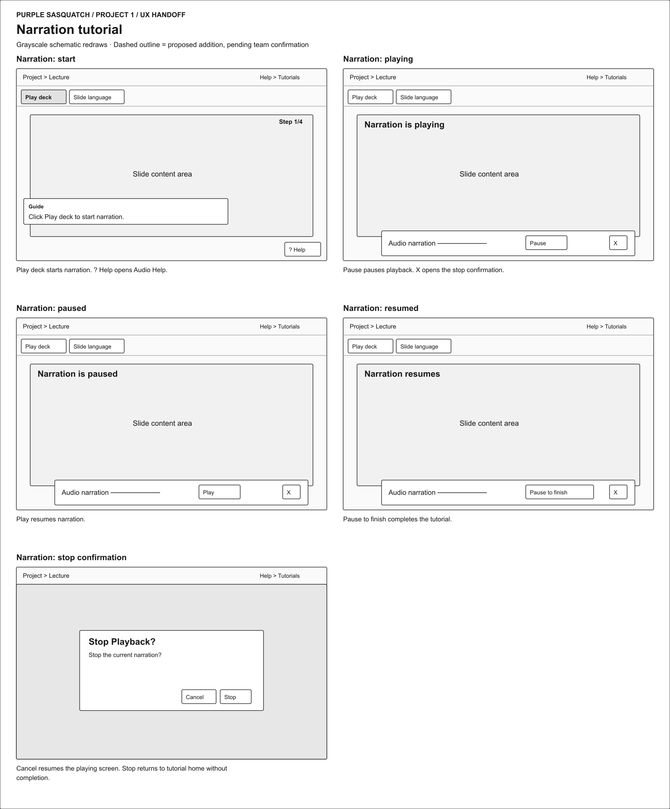

Start playback, pause, resume, and confirm stopping.

### Help and proposed recovery

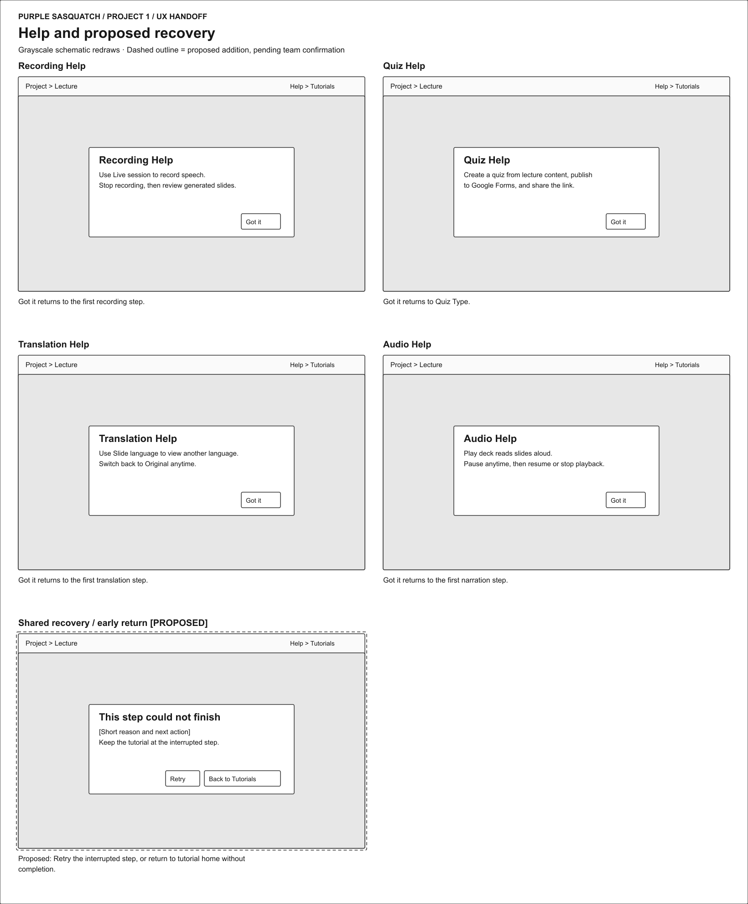

Help returns to the first step of the relevant tutorial, except Quiz Help, which returns to Quiz Type. The proposed recovery dialog offers **Retry** when retrying is possible, or **Back to Tutorials** without marking the tutorial complete; existing lecture content is preserved.

## Clickable Prototype

See instructions. Delete this line and place a publicly-accessible link to your clickable prototype here.

## Stakeholder Demo

See instructions. Delete this line and place a link to the deck The Slide Machine generated during your presentation here, after you have presented.

## Exit Ticket

See instructions. Delete this line and place a link to the exit-ticket quiz you generated from your demo deck and distributed to the class, along with a short note on what — if anything — you had to correct in the generated questions before publishing.
